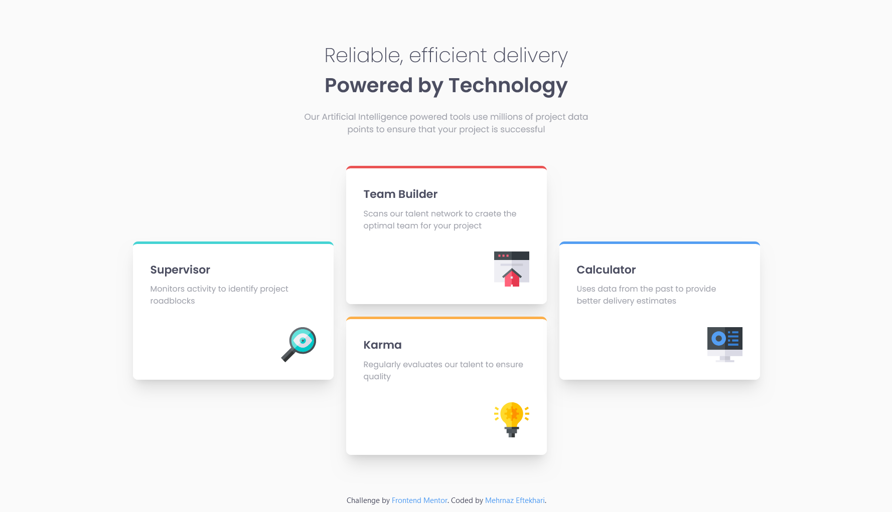

# Frontend Mentor - Four card feature section solution

This is a solution to the [Four card feature section challenge on Frontend Mentor](https://www.frontendmentor.io/challenges/four-card-feature-section-weK1eFYK). Frontend Mentor challenges help you improve your coding skills by building realistic projects.

## Table of contents

- [Overview](#overview)
  - [The challenge](#the-challenge)
  - [Screenshot](#screenshot)
  - [Links](#links)
- [My process](#my-process)

  - [Built with](#built-with)
  - [What I learned](#what-i-learned)
  - [Continued development](#continued-development)
  - [Useful resources](#useful-resources)
  - [Color Palette](#color-Palette)
  - [Fonts](#fonts)

- [Author](#author)
- [Acknowledgments](#acknowledgments)

## Overview

### The challenge

Users should be able to:

- View the optimal layout for the site depending on their device's screen size

### Screenshots




### Links

- Solution URL: [View on GitHub](https://github.com/mehrnaz98/four-card-feature-section)
- Live Site URL: [View on Netlify](https://clever-basbousa-a8307f.netlify.app/)

## My process

### Built with

- Semantic HTML5 markup
- CSS Grid for layout
- Tailwind CSS for styling
- Vue 3 (Composition API)

### What I learned

I improved my skills in dynamic styling by passing the border color as a prop in Vue.js and using Tailwind CSS classes effectively. Here's how I dynamically applied a border color to the `BaseCard` component based on the `borderColor` prop:

```vue
<div :class="[`border-[${borderColor}]`]"></div>
```

Additionally, I enhanced my understanding of layout techniques by working with CSS Grid. Unlike Flexbox, which is one-dimensional, CSS Grid allows for two-dimensional layouts, making it better suited for this project. It enabled me to create a more responsive design, efficiently managing both rows and columns to adapt to various screen sizes.

### Continued development

I want to continue refining my use of CSS Grid for more complex layouts and further explore dynamic styling in Vue.js, especially for larger-scale projects.

### Useful resources

- [Tailwind CSS Documentation](https://tailwindcss.com/docs) - Helped me quickly set up responsive styles.
- [Vue.js Docs](https://vuejs.org) - For better understanding of props and component composition.

Yes, including the colors used in your project can be very helpful! It provides a clear reference for anyone viewing your README and can assist in maintaining consistency if the project is further developed. You can create a section for the color palette and list the colors with their corresponding names or uses. Here’s how you might structure that section:

### Color Palette

#### Primary

- Red: hsl(0, 78%, 62%)
- Cyan: hsl(180, 62%, 55%)
- Orange: hsl(34, 97%, 64%)
- Blue: hsl(212, 86%, 64%)

#### Neutral

- Very Dark Blue: hsl(234, 12%, 34%)
- Grayish Blue: hsl(229, 6%, 66%)
- Very Light Gray: hsl(0, 0%, 98%)

### Fonts

- Family: [Poppins](https://fonts.google.com/specimen/Poppins)
- Weights: 200, 400, 600

## Author

- GitHub - [mehrnaz98](https://github.com/mehrnaz98/)
- Frontend Mentor - [mehrnaz98](https://www.frontendmentor.io/profile/mehrnaz98)

## Acknowledgments

Special thanks to the Frontend Mentor community for inspiration.
